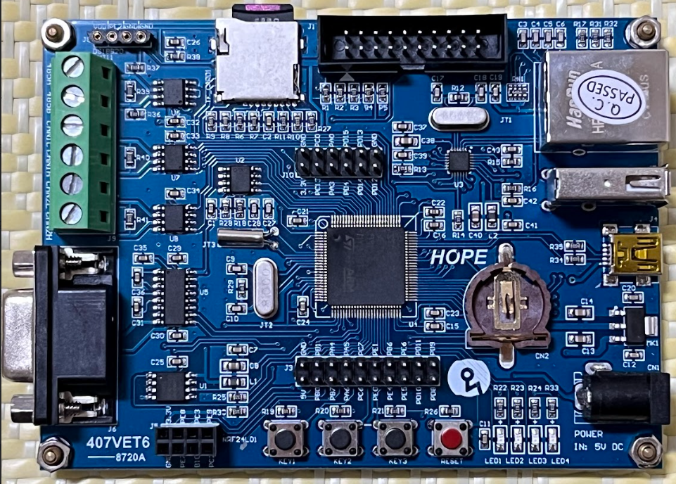

# STM32F4 IAP firmware
## Introduction
This repository shows an example to write an **in-application programming (IAP)** firmware on STM32F4 chips by Hardware Application Layer (HAL) library.

This firmware is tested on the following STM32 board:

## Features
* Use **UART** as the communication interface between MCU and host machine.
* Use a **self-defining protocol** to send commands to MCU and startup the specific modes.
* Use a **SD card** to store the uploaded binary file.
* Design **two modes** to achieve some functionalities
	* Interaction mode: this mode can interact with MCU and send commands to accomplish the designated operation.
		* Change to upload mode.
		* Update the flash with a new firmware stored in a SD card.
		* Launch the application.
	* Upload mode
		* Upload a new firmware and store it in a SD card.
* Use **Object-Oriented Programming (OOP)** to develop the IAP firmware.

## Dependent libraries
* STM32 HAL
* FATFS

## How to use the IAP firmware?
### 0. Upload IAP firmware to STM32 via ST-LINK
At the first time, the IAP firmware doesn't exist in the flash, so it must use ST-LINK to upload the IAP firmware to flash.
After uploading the IAP firmware once, the subsequent uploads (applications) can be completed by the UART. Unless it must update the IAP firmware, the ST-LINK will not be necessary because all uploads and updates can be achieved by the IAP firmware.

### 1. Enter to interaction mode / Launch the application automatically
At the beginning, after supplying power or resetting the MCU, the IAP firmware will wait for the first command requesting to enter the interaction mode.

If receiving the correct command, MCU will enter to interaction process and wait for the subsequent commands. (go to step 2.)

Otherwise, if there is no any command being sent to MCU, the IAP firmware will launch the application automatically after exceeding 5 seconds. (go to step 3)

### 2. Interaction mode
Under the interaction mode, the MCU will wait for the next commands and execute the corresponding operations:
#### a. Change to upload mode
After changing to upload mode, the MCU will wait for the subsequent upload commands **including the content of a application**, and store the all received bytes in a SD card after receiving a finish command.

#### b. Update the flash with the lastet firmware
after receiving the update command, the IAP firmware will update the specific memory region with the firmware stored in the SD card.
During the update process, MCU will send the progress information to the host machine, and send the terminated information to inform the host machine that the update process is finished.

#### c. Launch the application
(Go to step 3 directly)

### 3. Launch the application
By the IAP firmware, the reset handler of the application will be called, and then the application will be executed.
